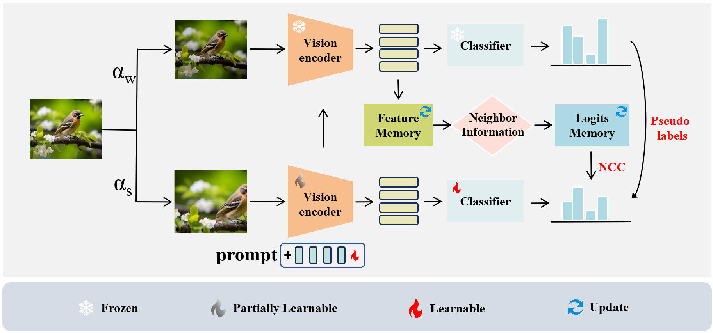

# Unsupervised Fine-tuning of Vision-Language Models by Fusing Classifier Tuning and Visual Prompt Tuning

We propose Fusing Classifier and Visual Prompt Tuning (FCVPT) for fine-tuning VLMs with unlabeled data. The core of FCVPT lies in the fusion of classifier tuning and visual prompt tuning during the fine-tuning process, leading to mutual enhancement.
Additionally, we introduce a Neighborhood Consistency Constraint (NCC) for robust self-training. NCC exploits similarities between training examples in the feature space, encouraging predictions for each example to closely align with those of its nearest neighbors. Empowered by FCVPT and NCC, our method, dubbed FCVPT-NCC, We provide the code for reproducing the results for all the 14 datasets used in our paper.



## Installation
This repository requires to install the environment and datasets:
- Code Base: Install `Dassl` library (under `FCVPT-NCC/`) in your environment by following the instructions [Dassl.pytorch](https://github.com/KaiyangZhou/Dassl.pytorch#installation).
- Package: To further install all other dependencies, please run: `pip install -r requirements.txt`
- Dataset: Follow [DATASETS.md](https://github.com/KaiyangZhou/CoOp/blob/main/DATASETS.md) to install the datasets.

*PS: You can also follow [CoOp](https://github.com/KaiyangZhou/CoOp) to perform the installation.*

## Environment
Python version: `3.8.10`; 

CUDA PyTorch: `11.3`; 

torch: `1.11.0+cu113`; 

torchversion: `0.12.0+cu113`;

GPU: `NVIDIA GeForce RTX 4090 D`.

## Experiments

### FCVPT-NCC
To run the full `FCVPT-NCC` pipeline, please run the following command:

```
bash scripts/FCVPT_NCC.sh <dataset_name>
```

where `<dataset_name>` can be `dtd`, `eurosat`, etc.
### CLIP Zero-Shot
Similarly, to obtain zero-shot CLIP results with the single prompt template `a photo of a {class}`. Please run: 

```
bash scripts/zeroshot.sh <dataset_name>
```

by replacing the `<dataset_name>` with one of the 14 datasets evaluated in the paper.


## Acknowledgment
This repository is mainly based on Kaiyang Zhou's repository [CoOp](https://github.com/KaiyangZhou/CoOp) code base. We sincerely thank Kaiyang for his awesome code base.
